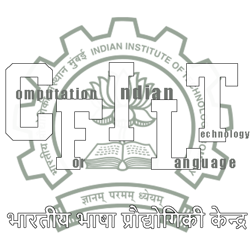

<p align="center"></p>

# A Python based API to access Indian language WordNets (pyiwn)
[](https://pypi.python.org/pypi/pyiwn)
[](https://github.com/cfiltnlp/pyiwn/issues)
[](https://github.com/cfiltnlp/pyiwn/network)
[](https://github.com/cfiltnlp/pyiwn/stargazers)
[](https://github.com/cfiltnlp/pyiwn/blob/master/LICENSE.txt)
[](https://twitter.com/cfiltnlp)
[](https://twitter.com/PeopleCentredAI)

pyIWN -- A Python based API to access Indian language WordNets -- This API gives access to synsets, glosses, examples, lexico-semantic relations between synsets, ontology nodes for 18 Indian languages, see [LANGUAGES.md](LANGUAGES.md) for the complete list of supported languages. In future, it will also provide access to speech data for words, glosses examples in Hindi WordNet.

## Prerequisite
Python 3.5+

## Installation

pyiwn can be installed using pip

```bash
pip install --upgrade pyiwn
```

or install it from the source

```bash
git clone https://github.com/riteshpanjwani/pyiwn.git
cd pyiwn
python setup.py install
```

Please see examples/ for further instructions and usage.

## Citing

If you publish work that uses pyiwn, please cite the pyiwn paper, as follows:

```
@inproceedings{panjwani2018pyiwn,
  title={pyiwn: A Python-based API to access Indian Language WordNets},
  author={Panjwani, Ritesh and Kanojia, Diptesh and Bhattacharyya, Pushpak},
  booktitle={Proceedings of the Global WordNet Conference},
  volume={2018},
  year={2018}
}
```


## Copyright

Copyright (C) 2017 pyiwn Project

For license information, see [LICENSE.txt](LICENSE.txt).

[AUTHORS.md](AUTHORS.md) have a list of everyone contributed to pyiwn.
